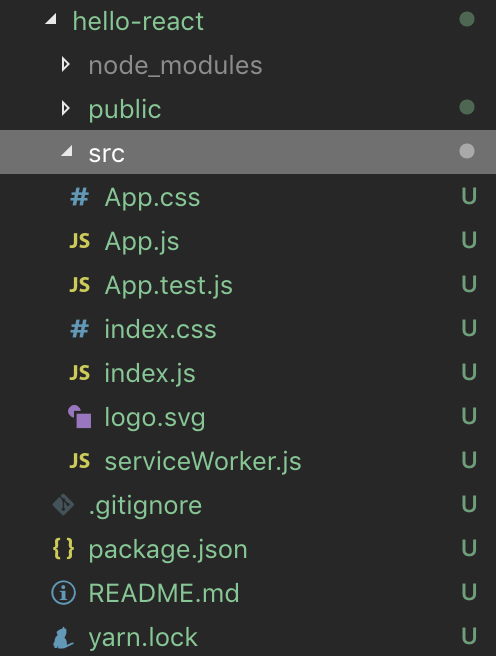

> 문서는 React에 대한 공부를 진행하면서 점차 필요한 것들을 추가할 예정입니다.


### 1. create-react-app 설치

```bash
yarn global add create-react-app
```

### 2. 프로젝트 생성

```bash
create-react-app project-name
```
> 프로젝트 이름에 대문자는 사용할 수 없다.

#### 폴더구조

- 생성한 프로젝트는 아래와 같은 폴더 구조를 가지고 있고, 딱 필수로 필요한 것들만을 포함하고 있다.



#### Dependency

```json
  "dependencies": {
    "react": "^16.8.6",
    "react-dom": "^16.8.6",
    "react-scripts": "3.0.1"
  }
```

### 3. 실행

```bash
yarn start
```