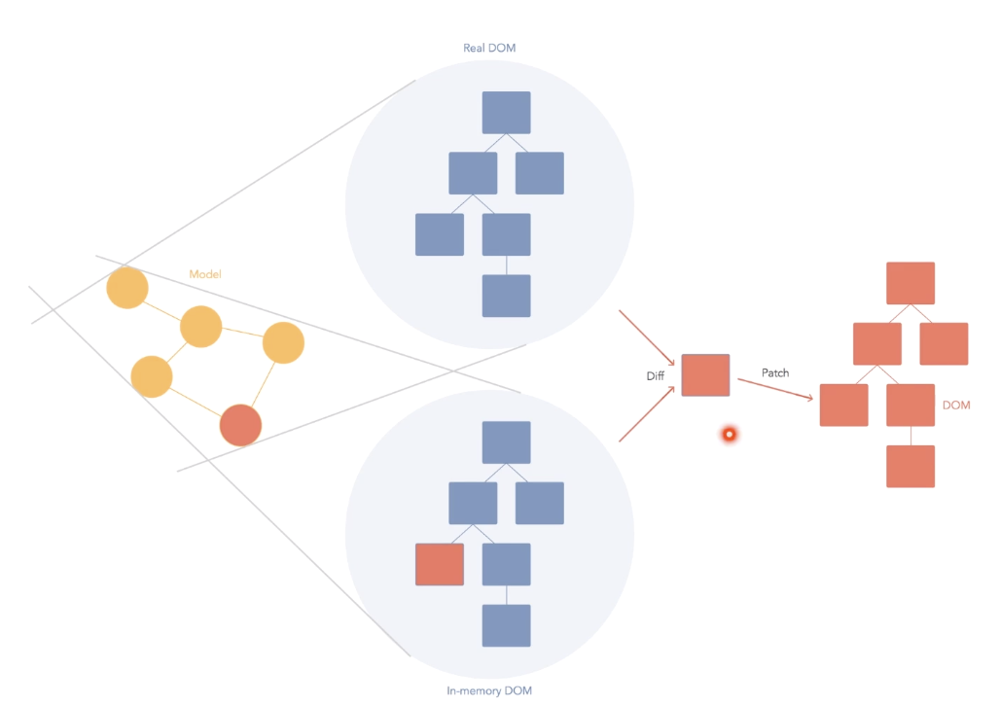

### 리액트란? 

- 리액트(React, React.js 또는 ReactJS)는 자바스크립트 라이브러리의 하나로서 사용자 인터페이스를 만들기 위해 사용된다.
- 컴포넌트 개념에 집중된 프론트엔드 `라이브러리`이다.
- 리액트 애플리케이션들은 상태 관리, 라우팅, API와의 통신을 위한 추가 라이브러리의 사용이 일반적으로 요구된다.

### 리액트란 왜 만들어젔을까?

- 사용자 인터랙션이 많고, 이에 따라 동적 UI를 제공하는 서비스에서 Javascript를 사용해서 직접 Dom을 Handling할 때 코드 복잡도가 증가한다.
  - 많은 이벤트 핸들러가 추가되고 관리가 힘들어진다.
  - 이에 따라 이러한 Dom Handling을 편하게 할 수 있도록 여러 프레임워크가 만들어젔다.
- Ember, Backbone, AngularJS
  - 자바스크립트의 특정 값과 Dom을 바인딩하여 자동으로 변경되도록 한다.
  - 프레임워크의 사용으로 업데이트 작업을 간소화하여 웹개발을 편하게 되었다.
- React 
  - `리액트는 새로운 발상에서 만들어젔다.`
  - 상태가 바뀌었을 때 그 상태에 따라 Dom을 어떻게 업데이트 할 지 규칙을 정하는 것이 아니라 통째로 새로 만들어서 보여준다는 아이디어에서 시작된 라이브러리이다.
  - 업데이트를 어떻게 해야 할 지에 대한 고민을 안함으로써 개발이 쉬워진다.
  - 새로 만드는 것에 대한 속도 이슈는 Virtual Dom으로 해결한다.

### Virtual Dom

- 브라우저에 실제로 보여지는 DOM이 아닌 메모리에 가상으로 존재하는 DOM
- JS 객체이기 때문에 작동 성능이 실제 브라우저에서 DOM을 보여주는 것보다 훨씬 빠르다.
- React는 상태가 업데이트 되면, 업데이트가 필요한 곳의 UI를 Virtual DOM을 통해 렌더링한다.
- 렌더링 후 업데이트는 DOM과 비교 후 차이가 있는 곳을 감지하여 실제 DOM에 패치한다.

## 참고

- https://ko.wikipedia.org/wiki/리액트
- https://react.vlpt.us/basic/01-concept.html