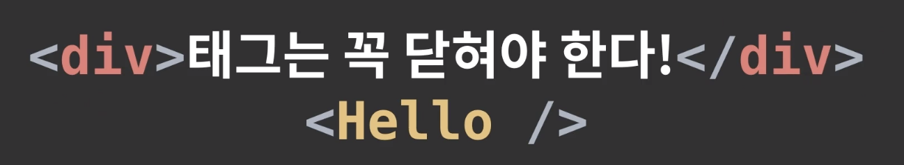
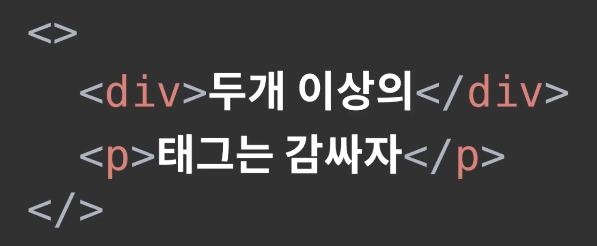
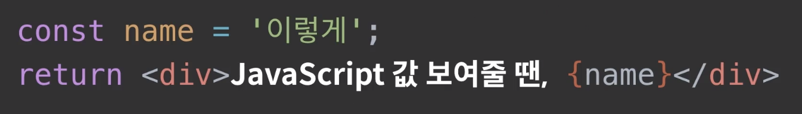
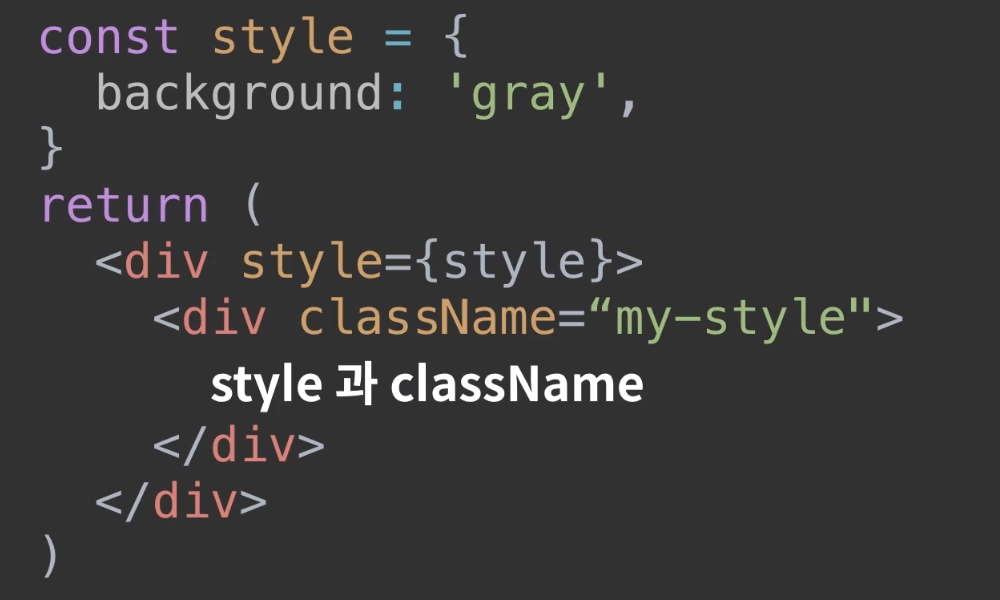
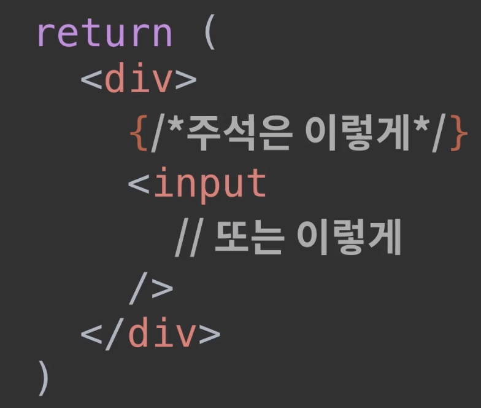

### JSX란? 

- Javascript로의 문법 확장이다.
- JSX는 템플릿 언어(HTML)처럼 보일 수 있지만, 실제로는 Javascript이다.
  - 리액트 컴포넌트 파일에서 JSX로 작성하면 bable이 Javascript로 변환해준다.
- 리액트에서는 JSX를 리액트와 함께 사용하여 UI가 실제로 어떻게 보일 지 설명하는 걸 권장한다.
- JSX는 React의 Component를 만든다.

### JSX 규칙

#### 1. 꼭 닫혀야 하는 태그



#### 2. 꼭 감싸져야하는 태그

- 두개 이상의 태그는 무조건 하나의 태그로 감싸져야 한다.
- 감싸는 태그는 div가 될 수도있고, 만약 불필요하게 div로 감싸는 것이 좋지 않은 상황이라면 Fragment를 사용한다.
  - 태그 작성시 이름 없이 작성하면 Fragment로 만들어진다.
  - Fragment는 브라우저 상에서 별도의 엘리먼트로 나타나지 않는다.



#### 3. JSX 안에서 자바스크립트 값 사용하기

- JSX 내부에서 자바스크립트 변수를 보여줘야 할 때에는 `{}` 로 감싸서 보여준다.



#### 4. Style 과 className

- JSX에서 태그에 style과 css class를 설정하는 방법은 HTML과 다르다.
- style은 객체로 만든다.
  - `-`로 구분된 이름은 camelCase로 변경한다.
  - background-color -> backgroundColor
- class는 className으로 지정한다.




```js
//App.css
.gray-box {
  background: gray;
  width: 64px;
  height: 64px;
}


//App.js
import React from 'react';
import Hello from './Hello';
import './App.css';


function App() {
  const name = 'react';
  const style = {
    backgroundColor: 'black',
    color: 'aqua',
    fontSize: 24, // 기본 단위 px
    padding: '1rem' // 다른 단위 사용 시 문자열로 설정
  }

  return (
    <>
      <Hello />
      <div style={style}>{name}</div>
      <div className="gray-box"></div>
    </>
  );
}

export default App;
```

#### 5. 주석

- JSX 내부의 주석은 {/* 이런 형태로 */} 작성한다.
- 추가적으로, 열리는 태그 내부에서는 // 이런 형태로도 주석 작성이 가능하다.





## 참고

- https://reactjs-kr.firebaseapp.com/docs/introducing-jsx.html
- https://react.vlpt.us/basic/04-jsx.html